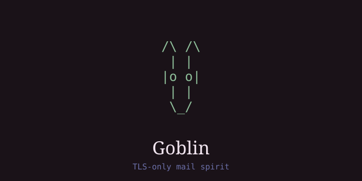
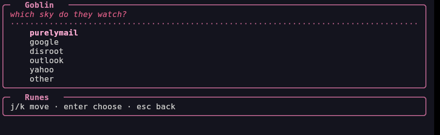

# Goblin — mail spirit. Ask him. **No aerc.** ✉️

Rust engine for [faeOS](https://github.com/ElegantVW/faeOS) and for company use. One binary: CLI + TUI. TLS-only, secrets in keyring — never in JSON, URLs, or logs.

Status: working TUI + CLI (`summon/who/wake/mend/dismiss/steal/peek/read/send/hunt/watch/keep/trash/parcel/squeak`). Voice: `goblin: <one sentence>` + `next: <one thing>`.

## Look




```
/\   /\
 |   | 
 |o o| 
 |   | 
  \_/  
```

## Rules

- **TLS required.** IMAP is 993 (implicit TLS) or 143 + STARTTLS. SMTP is 465 (implicit TLS) or 587 + STARTTLS. Certificate verification is on. There is no insecure flag.
- **Secrets stay out of JSON.** OS keyring first (`service=goblin`). Fallback: a `0600` `secrets` file. Optional `accounts.json.gpg` via system `gpg`. Never in URLs, argv, logs, or Pixie output.
- **No other mail programs.** Not aerc, isync, msmtp, notmuch, or himalaya. `goblin import-aerc` is a one-shot migrator and never copies the password into `accounts.json`.

## Install

```bash
git clone git@github.com:ElegantVW/goblin.git ~/goblin
cd ~/goblin && ./build.sh install
```

`build.sh install` writes the ELF to `~/.local/lib/faeos/goblin` and a launcher to `~/bin/goblin`. Override the binary with `GOBLIN_BIN`.

## First run

```bash
goblin summon            # pick purelymail / google / disroot / outlook / yahoo
goblin steal
goblin
```

## Commands

```
goblin                         open the horde
goblin summon [--preset google]
goblin who · wake NAME · mend [NAME] · dismiss [NAME]
goblin steal                   new letters
goblin peek [unread|read|trash]
goblin read 1
goblin send --to ADDR --subject STR
goblin hunt invoice
goblin watch
goblin keep | trash
goblin parcel list|save|open
goblin squeak [--set FILE]
```

Old names (`sync`, `list`, `show`, `search`, `account`…) still work as aliases.

TUI: `/` hunt · `[]` wake · `N` summon · `X` dismiss · `a` parcel.

Linux paths: `~/.config/goblin/`, `~/.cache/goblin/mail/{unread,read,trash}/`.

## License

MIT — see [LICENSE](LICENSE).
